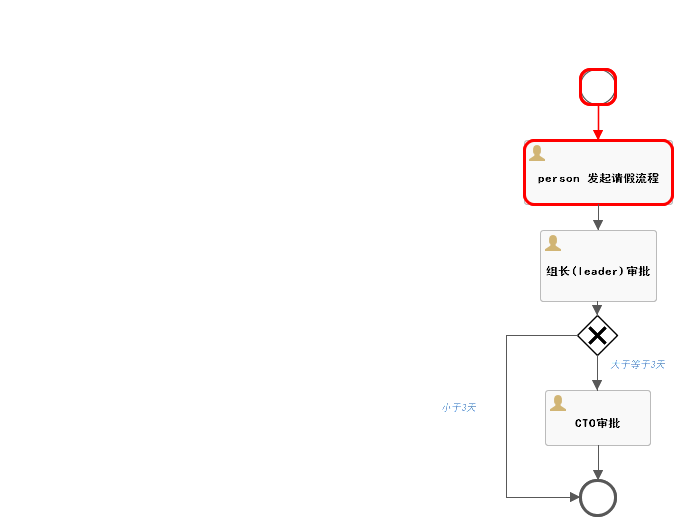
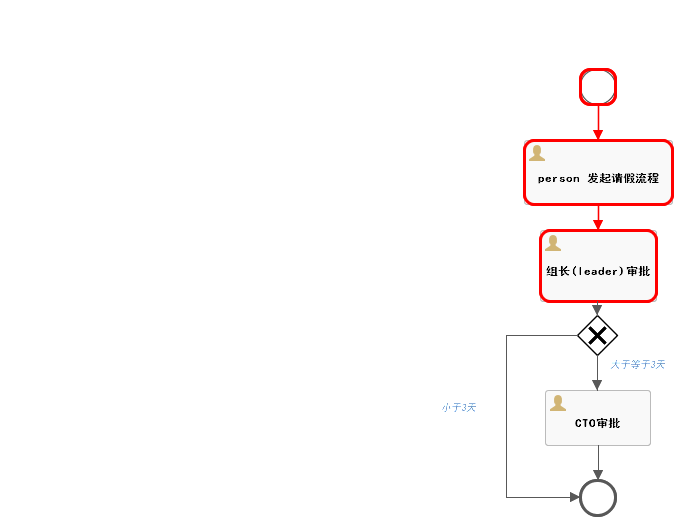

# Spring 集成 activiti

## 部署项目 
- 修改数据库配置，启动项目。

# 访问地址
1、查看 person 的任务列表
http://localhost:8081/task?processDefinitionKey=askforleave&userName=person
此时无任务

2、启动流程
http://localhost:8081/start?processesKey=askforleave
此时展示任务信息如下:
```json
{
  "name": null,
  "processDefinitionId": "askforleave:1:4",
  "startUserId": null,
  "processDefinitionName": "请假流程",
  "id": "5",
  "deploymentId": null
}
```

3、再次查看 person 的任务列表
http://localhost:8081/task?processDefinitionKey=askforleave&userName=person
```json
[
  {
    "processInstanceId": "5",
    "processDefinitionId": "askforleave:1:4",
    "createTime": "2021-11-12T08:02:37.741+00:00",
    "name": "person 发起请假流程",
    "description": null,
    "id": "9",
    "assignee": "person"
  }
]
```

4、根据实例ID查询流程
http://localhost:8081/queryByTaskId?processInstanceId=5
```json
{
  "processInstanceId": "5",
  "deploymentId": "1",
  "processDefinitionName": "请假流程"
}
```

5、查看流程图
http://localhost:8081/viewProcessImgHighLighted?processInstanceId=5


6、查看 leader 的任务列表
http://localhost:8081/task?processDefinitionKey=askforleave&userName=leader
此时无任务

7、查看 cto 的任务列表
http://localhost:8081/task?processDefinitionKey=askforleave&userName=cto
此时无任务

8、person 选择请假天数，提交审批
http://localhost:8081/completeTask?taskId=9&day=2

9、再次查看流程图及三人的任务列表


10、leader 选择审批拒绝


## activiti 会在数据库生成28张表：
表名默认以“ACT_”开头,并且表名的第二部分用两个字母表明表的用例，而这个用例也基本上跟Service API匹配。

- ACT_GE_* : “GE” 代表 “General”（通用），用在各种情况下；
- ACT_HI_* : “HI” 代表 “History”（历史），这些表中保存的都是历史数据，比如执行过的流程实例、变量、任务，等等。Activit默认提供了4种历史级别；
- ACT_ID_* : “ID” 代表 “Identity”（身份），这些表中保存的都是身份信息，如用户和组以及两者之间的关系。如果Activiti被集成在某一系统当中的话，这些表可以不用，可以直接使用现有系统中的用户或组信息；
- ACT_RE_* : “RE” 代表 “Repository”（仓库），这些表中保存一些‘静态’信息，如流程定义和流程资源（如图片、规则等）；
- ACT_RU_* : “RU” 代表 “Runtime”（运行时），这些表中保存一些流程实例、用户任务、变量等的运行时数据。Activiti只保存流程实例在执行过程中的运行时数据，并且当流程结束后会立即移除这些数据，这是为了保证运行时表尽量的小并运行的足够快；

## 一般数据

- act_evt_log	事件处理日志表
- act_ge_bytearray	通用的流程定义和流程资源
- act_ge_property	系统相关属性

## 流程历史记录

- act_hi_actinst	历史的流程实例
- act_hi_attachment	历史的流程附件
- act_hi_comment	历史的说明性信息
- act_hi_detail	历史的流程运行中的细节信息
- act_hi_identitylink	历史的流程运行过程中用户关系
- act_hi_procinst	历史的流程实例
- act_hi_taskinst	历史的任务实例
- act_hi_varinst	历史的流程运行中的变量信息

## 用户用户组表

- act_id_group	身份信息-用户组信息表
- act_id_info	身份信息
- act_id_membership	身份信息
- act_id_user	身份信息
- act_procdef_info	流程定义数据表

## 流程定义表

- act_re_deployment	部署单元信息
- act_re_model	模型信息
- act_re_procdef	已部署的流程定义

## 运行实例表

- act_ru_deadletter_job	执行失败任务表
- act_ru_event_subscr	运行时事件
- act_ru_execution	运行时流程执行实例
- act_ru_identitylink	运行时用户关系信息
- act_ru_job	运行时作业
- act_ru_suspended_job	运行时暂停任务
- act_ru_task	运行时任务
- act_ru_timer_job	运行时定时任务
- act_ru_variable	运行时变量表

## Activiti提供的服务-7大接口:

RepositoryService：提供一系列管理流程部署和流程定义的API，帮助我们实现流程定义的部署。此服务会处理与流程定义相关的静态数据。
RuntimeService：在流程运行时对流程实例进行管理与控制。管理 ProcessInstances（当前正在运行的流程）以及流程变量
TaskService：对流程任务进行管理，例如任务提醒、任务完成和创建任务等。会跟踪 UserTasks，需要由用户手动执行的任务是Activiti API的核心。我们可以使用此服务创建任务，声明并完成任务，分配任务的受让人等。
FormService：表单服务。是一项可选服务，它用于定义中开始表单和任务表单。
IdentityService：提供对流程角色数据进行管理的API，这些角色数据包括用户组、用户及它们之间的关系。管理用户和组。
HistoryService：对流程的历史数据进行操作，包括查询、删除这些历史数据。我们还可以设置不同的历史级别。
ManagementService：提供对流程引擎进行管理和维护的服务。与元数据相关，在创建应用程序时通常不需要。
DynamicBpmnService：帮助我们在不重新部署的情况下更改流程中的任何内容。

## 修改 jbpm 流程图
因为 idea 对应插件 2014年已经停止更新， 所以需要下载 eclipse 及 activiti 插件。


## 什么是会签
 在流程业务管理中，任务是通常都是由一个人去处理的，而多个人同时处理一个任务，这种任务我们称之为会签任务。

### 会签的种类
- 按数量通过：达到一定数量的通过表决后，会签通过。
- 按比例通过：达到一定比例的通过表决后，会签通过。
- 一票否决：只要有一个表决时否定的，会签通过。
- 一票通过：只要有一个表决通过的，会签通过。

## 参考链接 
业务流程管理或商业流程管理（英语：Business Process Management，简称BPM）
- https://zh.wikipedia.org/wiki/%E4%B8%9A%E5%8A%A1%E6%B5%81%E7%A8%8B%E7%AE%A1%E7%90%86