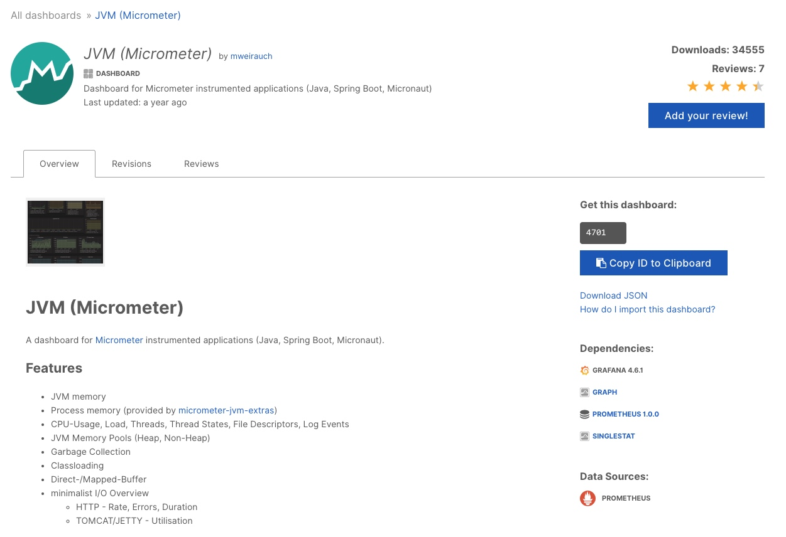
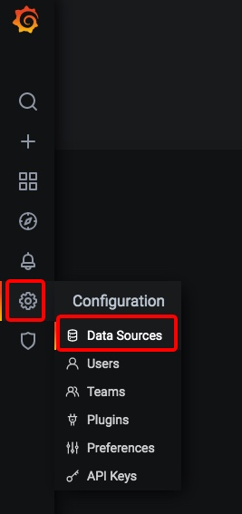
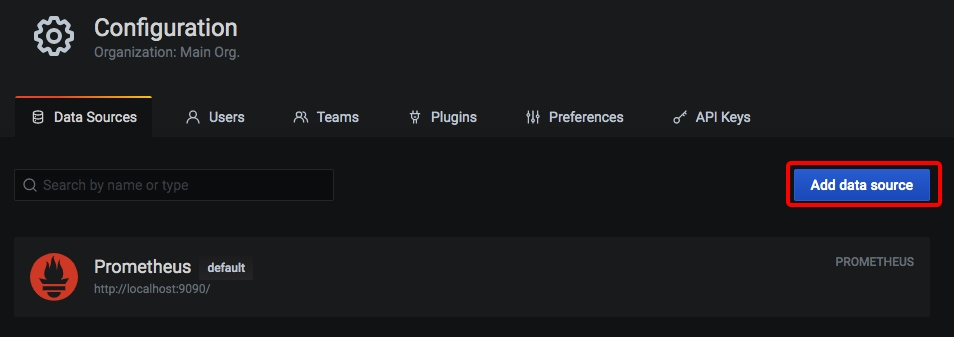
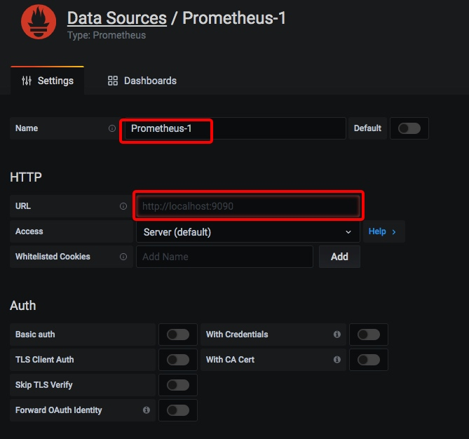
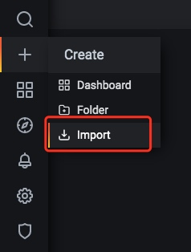
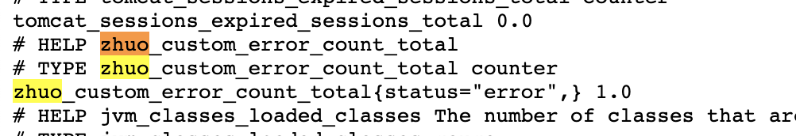

# Spring 监控机制

## Spring Actuator 快速入门

启动项目，访问如下网址 http://localhost:8080/actuator/health 查看应用的健康状态，正常情况下会返回 UP 信息。

```json
{
  "status": "UP"
}
```

除了提供最基本的健康检查外，actuator 还提供了许多其他的端点（Endpoints）信息。通过这些端点信息，我们可以掌握 99% 的应用状态信息。

## 端点暴露配置

可以通过以下配置，来配置通过 JMX 和 HTTP 暴露的端点。

|                   属性                    |    默认值    |
| :---------------------------------------: | :----------: |
| management.endpoints.jmx.exposure.exclude |              |
| management.endpoints.jmx.exposure.include |      *       |
| management.endpoints.web.exposure.exclude |              |
| management.endpoints.web.exposure.include | info, health |

我们可以选择打开所有的监控点，例如：

```
management.endpoints.web.exposure.include=*
```

也可以选择打开部分端点，例如下面的配置打开 beans 和 trace 两个端点。

```
management.endpoints.web.exposure.exclude=beans,trace
```

Actuator 默认所有的监控点路径都在 `/actuator/*`，当然如果有需要这个路径也支持定制。例如下面的配置将前缀改成了 monitor，那么访问路径就变成了 `/monitor/*`。

```
management.endpoints.web.base-path=/minitor
```

这里我们在 application.yml 中加入如下配置，默认打开所有端点。

```
management.endpoints.web.exposure.include=*
```

接着我们访问地址：[localhost:8080/actuator/metrics](http://localhost:8080/actuator/metrics)，可以看到所有的指标地址。

## 常用端点介绍

Spring Boot Actuator 提供了 Endpoints（端点）给外部来与应用程序进行访问和交互。

例如 `/health` 端点提供了关于应用健康情况的一些基础信息。`/metrics` 端点提供了一些有用的应用程序指标（JVM 内存使用、系统 CPU 使用等）。

一般来说，端点可以分为几类：

- 应用配置类：获取应用程序中加载的应用配置、环境变量、自动化配置报告等与 Spring Boot 应用密切相关的配置类信息。
- 度量指标类：获取应用程序运行过程中用于监控的度量指标，比如：内存信息、线程池信息、HTTP 请求统计等。
- 操作控制类：提供了对应用的关闭等操作类功能。
  详细的原生端点介绍，请以官网为准，这里就不赘述徒增篇幅。

### health端点

`/health` 端点会聚合你程序的健康指标，来检查程序的健康情况。端点公开的应用健康信息取决于参数 `management.endpoint.health.show-details`，该属性值可选项为：

|     属性值      |                             描述                             |
| :-------------: | :----------------------------------------------------------: |
|      never      |        不展示详细信息，up 或者 down 的状态，默认配置         |
| when-authorized | 详细信息将会展示给通过认证的用户。授权的角色可以通过management.endpoint.health.roles 配置 |
|     always      |                    对所有用户暴露详细信息                    |

配置成 always 之后，启动应用，访问 [localhost:8080/actuator/health](http://localhost:8080/actuator/health) 查看应用的健康状态，正常情况下会返回 UP 信息。

除了使用自动引入的健康指示器之外，我们也可以自定义一个 Health Indicator，只需要实现 HealthIndicator 接口或者继承 AbstractHealthIndicator 类。

例如我们创建了一个 CustomHealthIndicator 类，继承了 AbstractHealthIndicator 类，并返回了一些健康信息。

**新增如下配置**

```
## 允许对所有用户暴露详细信息
management.endpoint.health.show-details=always
```

访问 http://localhost:8080/actuator/health 可以看到返回详细信息

```json
{
  "status": "UP",
  "components": {
    "custom": {
      "status": "UP",
      "details": {
        "app": "项目很健康！",
        "error": "项目有点问题！"
      }
    },
    "diskSpace": {
      "status": "UP",
      "details": {
        "total": 499963174912,
        "free": 324124966912,
        "threshold": 10485760,
        "exists": true
      }
    },
    "ping": {
      "status": "UP"
    }
  }
}
```

### metrics端点

/metrics 端点用来返回当前应用的各类重要度量指标，比如：内存信息、线程信息、垃圾回收信息、tomcat、数据库连接池等。当我们访问：[localhost:8080/actuator/metrics](http://localhost:8080/actuator/metrics) 时，会返回 SpringBoot Actuator 的所有可查看端点信息。

```json

{
  "names": [
    "http.server.requests",
    "jvm.buffer.count",
    "jvm.buffer.memory.used",
    "jvm.buffer.total.capacity",
    "jvm.classes.loaded",
    "jvm.classes.unloaded",
    "jvm.gc.live.data.size",
    "jvm.gc.max.data.size",
    "jvm.gc.memory.allocated",
    "jvm.gc.memory.promoted",
    "jvm.gc.pause",
    "jvm.memory.committed",
    "jvm.memory.max",
    "jvm.memory.used",
    "jvm.threads.daemon",
    "jvm.threads.live",
    "jvm.threads.peak",
    "jvm.threads.states",
    "logback.events",
    "process.cpu.usage",
    "process.files.max",
    "process.files.open",
    "process.start.time",
    "process.uptime",
    "system.cpu.count",
    "system.cpu.usage",
    "system.load.average.1m",
    "tomcat.sessions.active.current",
    "tomcat.sessions.active.max",
    "tomcat.sessions.alive.max",
    "tomcat.sessions.created",
    "tomcat.sessions.expired",
    "tomcat.sessions.rejected"
  ]
}
```

我们可以进一步使用如下格式的 URL 访问到对应的信息：

```
http://localhost:8080/actuator/metrics/{MetricName}
```

例如我想访问 `system.cpu.count` 这个指标，那么我访问这个链接即可：[localhost:8080/actuator/metrics/system.cpu.count](http://localhost:8080/actuator/metrics/system.cpu.count)

```json

{
  "name": "system.cpu.count",
  "description": "The number of processors available to the Java virtual machine",
  "baseUnit": null,
  "measurements": [
    {
      "statistic": "VALUE",
      "value": 8.0
    }
  ],
  "availableTags": [
    
  ]
}
```

### loggers端点

/loggers 端点暴露了我们程序内部配置的所有 logger 的信息，我们访问这个链接就可以看到：[localhost:8080/actuator/loggers](http://localhost:8080/actuator/loggers)。

我们也可以通过下述方式访问某一个 logger

```
http://localhost:8080/actuator/loggers/{name}
```

例如我想访问 Root Logger，就可以访问这个链接：[localhost:8080/actuator/loggers/ROOT](http://localhost:8080/actuator/loggers/ROOT)，返回信息如下：

```
{
	"configuredLevel": "INFO",
	"effectiveLevel": "INFO"
}
```

### info端点

`/info` 端点可以用来查看配置文件 `application.properties` 中 info 节点下的配置信息，默认情况下 `application.properties` 中并没有 info 节点配置，所以当我们访问 [localhost:8080/actuator/info](http://localhost:8080/actuator/info) 时会访问空 JSON 串。

```json
{
  
}
```

接下来我们在 `application.properties` 中增加了如下配置：

```
info.app.name=actuator-demo
info.app.encoding=UTF-8
info.app.java.source=1.8
info.app.java.target=1.8
```

再次访问 [localhost:8080/actuator/info](http://localhost:8080/actuator/info) 会返回 info 节点的信息：

```json
{
  "app": {
    "name": "actuator-demo",
    "encoding": "UTF-8",
    "java": {
      "source": "1.8",
      "target": "1.8"
    }
  }
}
```

要注意，info 端点只会返回 info 节点下的信息，而不会返回其他节点下的信息。例如我在配置文件中添加如下配置：

```
project.name=demo
```

这时候通过 info 端点是访问不到该配置信息的。

### beans端点

`/beans` 端点会返回 Spring 容器中所有 bean 的别名、类型、是否单例、依赖等信息。

当我们访问 [localhost:8080/actuator/beans](http://localhost:8080/actuator/beans) 时，会返回如下信息：

```json
{
	"contexts": {
		"application": {
			"beans": {
				"endpointCachingOperationInvokerAdvisor": {
					"aliases": [//别名
						
					],
					"scope": "singleton",//作用域
					"type": "org.springframework.boot.actuate.endpoint.invoker.cache.CachingOperationInvokerAdvisor",//类型
					"resource": "class path resource [org/springframework/boot/actuate/autoconfigure/endpoint/EndpointAutoConfiguration.class]",
					"dependencies": [
						"environment"
					]
				}
			}
		}
	}
}
```

### heapdump端点

访问 http://localhost:8080/actuator/heapdump 会自动生成一个 JVM 的堆文件 heapdump。

我们可以使用 JDK 自带的 JVM 监控工具 VisualVM 打开此文件查看内存快照。

### threaddump端点

访问 [localhost:8080/actuator/threaddump](http://localhost:8080/actuator/threaddump) 会返回应用的线程信息，包括线程名、线程 ID、线程的状态、是否等待锁资源、线程堆栈等信息。

### shutdown端点

这个端点属于操作控制类端点，可以优雅关闭 Spring Boot 应用。要使用这个功能首先需要在配置文件中开启：

```
management.endpoint.shutdown.enabled=true
```

由于 shutdown 接口默认只支持 POST 请求，我们启动 Demo 项目，向 http://localhost:8080/actuator/shutdown 发起 POST 请求。

远程操作相对来说比较危险，所以一般在线上都不会开启这个端点。

## 使用 Prometheus + Grafana 实现监控

上面我们用 actuator 暴露应用本身的线程、bean 等信息，但是这些信息还是独立于 Prometheus 之外的。下面我们将介绍如何将 SpringBoot Actuator 与 Prometheus 结合起来。

新增包依赖

```xml
<dependency>
    <groupId>io.micrometer</groupId>
    <artifactId>micrometer-registry-prometheus</artifactId>
    <scope>runtime</scope>
</dependency>
```

项目打开后，在 `application.properties` 中加入如下配置，打开相关的端口。

```
management.endpoint.metrics.enabled=true
management.endpoints.web.exposure.include=*
management.endpoint.prometheus.enabled=true
management.metrics.export.prometheus.enabled=true

## grafana 面板上的 application 名称
management.metrics.tags.application=actuator_zhuo
```

接着启动项目，访问 [localhost:8080/actuator/prometheus](http://localhost:8080/actuator/prometheus) 可以看到 SpringBoot 的应用信息都以 Prometheus 的标准形式输出了。

下面我们使用 [Grafana官网 - Dashboards 模块](https://grafana.com/grafana/dashboards) 中的「JVM（Micrometer）」图表模板来展示应用的各项指标。点击 [JVM (Micrometer) dashboard for Grafana | Grafana Labs](https://grafana.com/grafana/dashboards/4701) 可以获取到 dashboard 的 ID 为：4701。



然后配置数据源，选择 prometheus 并将本地地址填入。







这里我们添加了一个名为「Prometheus-1」的数据源，数据获取地址为：[http://localhost:9090](http://localhost:9090/)。


接着我们在 Grafana 页面点击「Import」菜单进入导入设置页面。



我们进入「Import」页面，填入模板的 ID，并点击「Load」按钮。

系统会自动读取模板 ID 对应的信息并显示在页面上。你需要选择模板的数据源，选择上面配置的 「Prometheus-1」数据源。

设置完毕后点击「Import」按钮，则进入到看板页面。

## 自定义 Prometheus 监控

新增  PrometheusCustomMonitor

访问 http://localhost:8080/actuator/prometheus 可以看到自定义的内容



在 grafana 上配置 panal


## grafana 常用面板变量配置

application

```
label_values(application)
```

instance

```
label_values(jvm_memory_used_bytes{application ="$application"}, instance)
```


sum(rate(http_server_requests_seconds_count{application="$application", instance="$instance"}[1m]))
